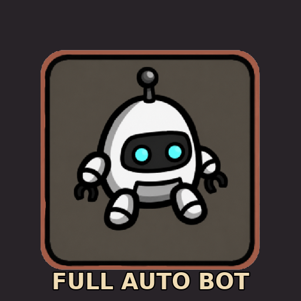
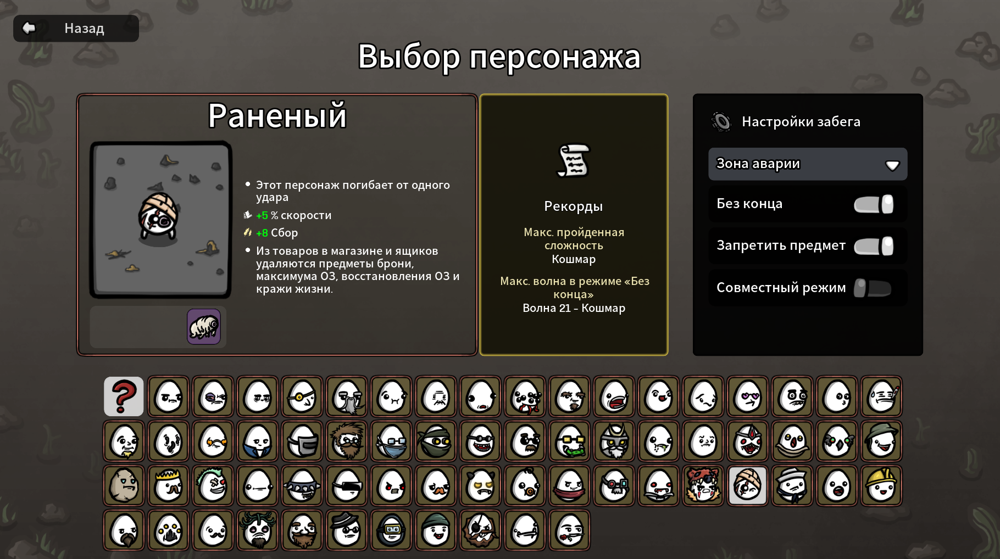
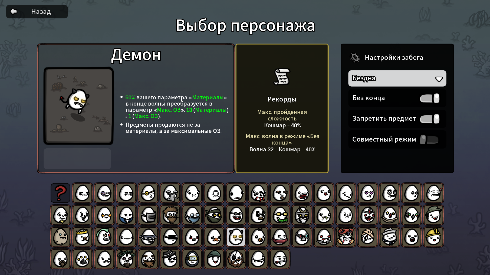

# Full Auto Bot — Brotato

[Русская версия →](README.ru.md)

A Steam Workshop mod that adds a **robot button** on the difficulty-selection
screen of Brotato. Press it once and the bot plays the entire **Danger 6
(Nightmare)** run for you — movement, shop, level-ups, crates — from wave 1
through wave 21 and into Endless.

**→ Subscribe on [Steam Workshop](https://steamcommunity.com/sharedfiles/filedetails/?id=3737864106)**

Works with all **64 characters** (50 base + 14 from *Abyssal Terrors*).

---

## What it does

- Adds an extra option on the difficulty screen next to **D0–D6**.
- Picks **Danger 6** automatically when the bot option is selected.
- Per-character strategies for all 64 base and DLC characters — custom
  build identity, weapon families, banned items, movement style.
- Ranged kiters, melee bruisers, no-weapon builds (Beast Master, Bull),
  pacifist hand-stack, explode-on-damage builds — each character gets its
  own playstyle.
- Real **DPS / effective-HP** scoring for shop and level-up picks. No
  naive per-stat heuristic.
- Multiple movement strategies: sampling flee, orbital flee, pure
  repulsion flee, panic-dodge override, dynamic dodge caution.
- Mirror-bullet trap avoidance (perpendicular escape when two projectiles
  cancel each other out).

## How to use

1. **[Subscribe to the mod in Steam Workshop](https://steamcommunity.com/sharedfiles/filedetails/?id=3737864106)**
   *(or download the latest release zip from this repo and drop it into your
   Brotato `mods/` folder).*
2. Make sure **ModLoader** is installed and enabled.
3. Launch Brotato. From the main menu enable **Full Auto Bot** under
   *Mods*.
4. Pick a character and a starting weapon as usual.
5. On the difficulty screen you will see a new robot icon. Click it.
6. The bot takes over and plays the run on **Danger 6**.

You can take control back at any time by pressing a movement key — the
bot yields to manual input immediately.

## Characters supported

All 64 characters, both base game and the *Abyssal Terrors* DLC. A few
examples:

| | |
|---|---|
|  |  |

## Compatibility

- Brotato **1.1.15+**
- Requires **ModLoader 6.x**
- Works with the *Abyssal Terrors* DLC characters
- Single-player only
- Linux (Steam Proton), Windows, macOS — pure GDScript, no native
  binaries

## Known limitations

- The first few waves of a run can be RNG-dependent. The bot does not
  rewind on bad starts.
- Some DLC character strategies are based on community meta — they will
  improve as feedback comes in.
- The bot does not currently chain into Endless mode automatically after
  wave 20 boss; it plays through whichever mode you selected.
- Linux/Proton users: if late-wave performance is poor, try forcing Proton 9.0 Beta (or vice versa). Proton-Experimental sometimes has worse Wine scheduler stability for Godot games.

## Looking for a co-op bot partner?

This mod is the solo sibling. If you want a bot that plays the
second slot in local **co-op** alongside you, install our other mod:
[Co-op Bot Partner](https://github.com/HelpFreedom/brotato-coop-bot-partner).
Same engine, drops a bot into player 2.

## Issues and feedback

- Open an issue on [GitHub](https://github.com/HelpFreedom/brotato-full-autobot/issues).
- Or post in the Workshop comments.

## Contributors

See [CONTRIBUTORS.md](CONTRIBUTORS.md). The mod was built by **Black
Triangle** in collaboration with **Claude (Anthropic Opus 4.7)**.

## License

**GNU General Public License v3.0** — see [LICENSE](LICENSE).

Brotato is © Blobfish. This mod ships only its own original code; no
decompiled Brotato sources are included.
